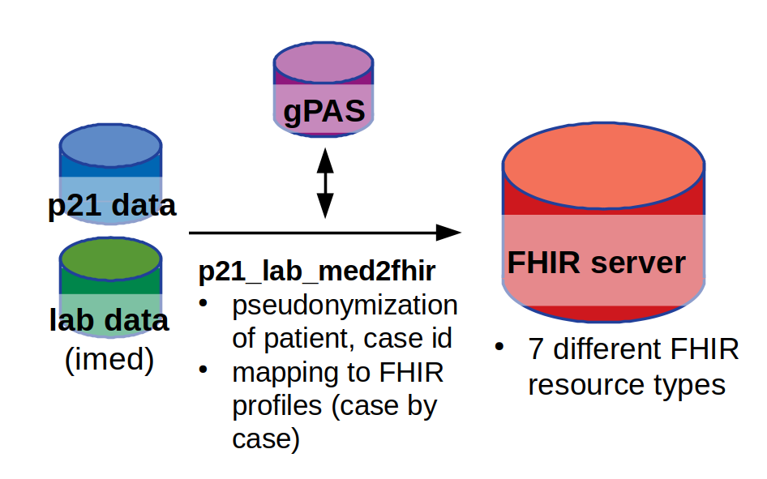
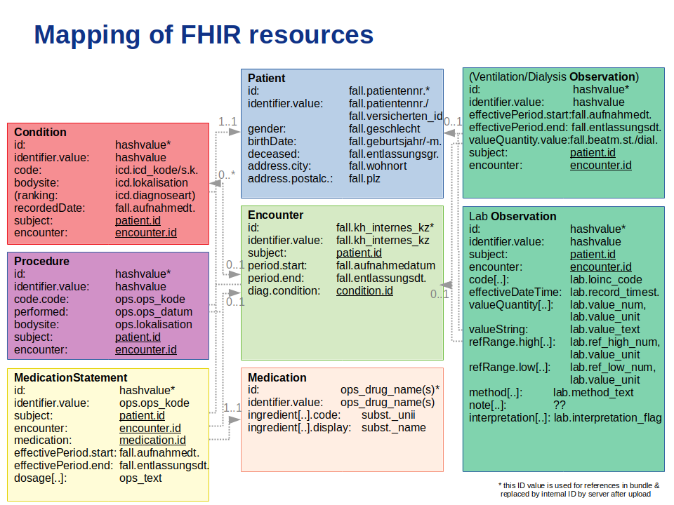

# dm_lab2fhir_inc

"dm_lab2fhir_inc" is an 'experimental' ETL job that transforms sap-ish (medication as ops), lung function (lufu), lab data from data warehouse and staging area to FHIR resources of different types, pseudonymizes the case, patient ID and uploads the resources to a FHIR server using an incremental update strategy. The FHIR Python libraries based on the FHIR profiles R4 were developed by SMART on FHIR (https://github.com/smart-on-fhir/client-py) and adjusted to the specifications in the MII/ MIRACUM FHIR profiles.

The data are mapped to eight different FHIR resource types (Condition, DiagnosticReport, Encounter, Medication, MedicationStatement, Observation, Patient and Procedure).

## Prerequisites

* Python v3.6, "Pip Installs Packages" (pip) v3.01
* PostgreSQL database containing health data from sap-ish and corresponding lung function, lab data
* gPAS server for pseudonymization with domains patient_id, encounter_id (https://github.com/mosaic-hgw/gPAS)
* HAPI FHIR server (https://github.com/jamesagnew/hapi-fhir) or PostgreSQL database as storage for FHIR resources

## How to install and start

* Set configuration in `config` file
* Run `./install.sh` to install the required external libraries in root directory
* Set python path to include libraries `export PYTHONPATH="<PATH>/dm_lab2fhir_inc"`
* Run `bin/app.py [-h] -s START_DATE -e END_DATE -c CONFIG_FILE_PATH -d {psql,hapi} [-n]` to execute ETL job

## Authors

* [Kim, Hee Eun](http://10.3.8.51/hee.kim)
* [Cosa-Linan, Alejandro](http://10.3.8.51/alejandro.cosa-lina)
* [Goetz, Lukas](http://10.3.8.51/Goetzlu)

## License

GNU General Public License v3.0
